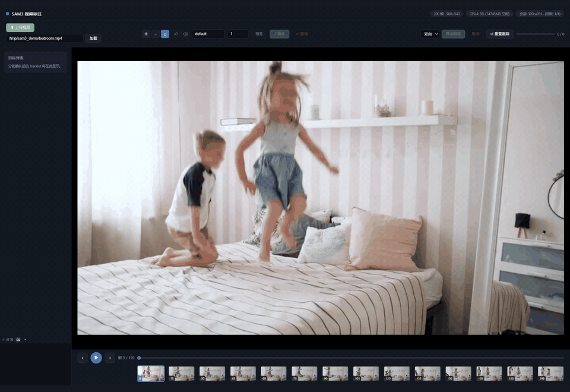
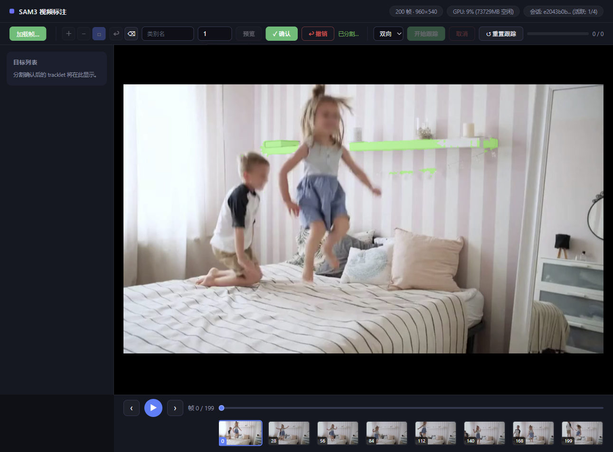
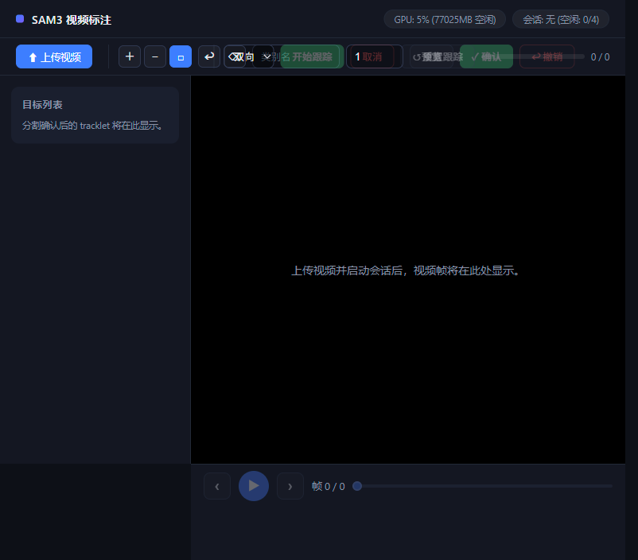
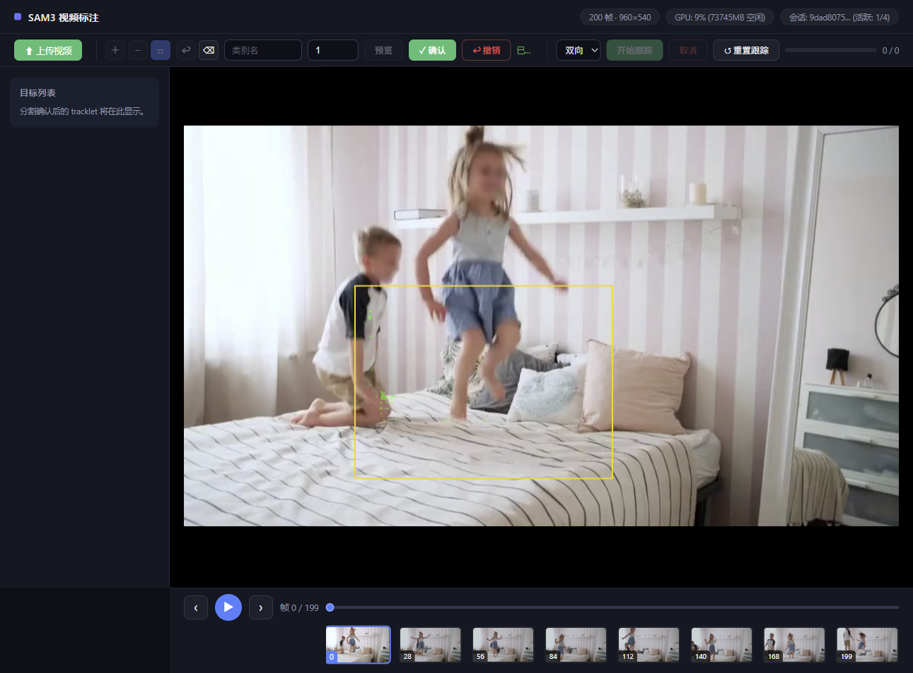
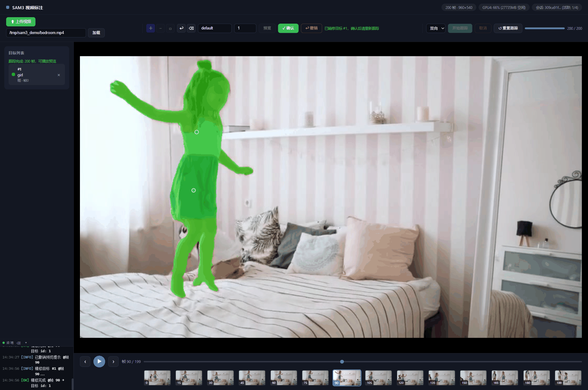
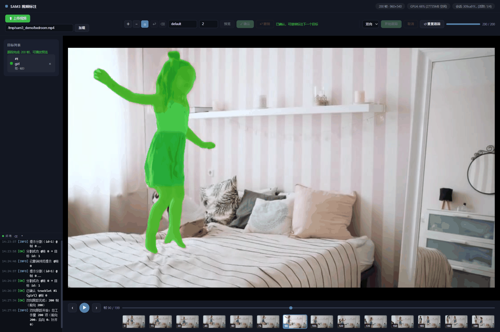

# SAM 3 Video Annotation Tool

English | [简体中文](README.md)

A browser-based **single-object video annotation tool** built on the video tracking engine of [Meta SAM 3](https://github.com/facebookresearch/sam3) (SAM2-task mode).

Annotate pixel-level segmentation for a single target in a video through an interactive workflow — **box initialization → cross-frame point refinement → mask propagation**. The frontend handles interaction and visualization; a FastAPI backend runs inference and session management, streaming masks and progress back over WebSocket in real time.

> This repository also ships the complete SAM 3 model code (`sam3/`). For the upstream official documentation see [facebookresearch/sam3](https://github.com/facebookresearch/sam3); for a deep dive into the model architecture see [sam3.md](sam3.md) (Chinese).

---

<p align="center">
  
</p>

---

## Feature Overview

### 1. Video Ingestion & Session Management

| Feature | Description |
|---|---|
| Local video upload | Pick an MP4 (or other) video file in the browser and upload it to the server |
| Server path loading | Start a session directly from a file on the server (no upload needed) |
| Automatic frame extraction | Frames are extracted at the video FPS, generating preview frames and a thumbnail strip |
| Session lifecycle | Start / close / delete sessions; session cache is cleared automatically on page disconnect |
| Automatic GPU selection | On startup the GPU with the most free memory is picked; the page shows live GPU status |

### 2. Interactive Prompting (two-stage: draw → preview → confirm)

| Feature | Description |
|---|---|
| Box prompt | Drag a box around the target; combinable with point prompts |
| Positive / negative points | Positive points mark the target, negative points exclude false-positive regions |
| Point + box combination | Freely combine points and boxes within one prompt and submit together |
| Undo & clear | Undo the most recent point; clear all pending prompts with one click |
| Mask preview | Run segmentation on demand before submitting; the mask is overlaid on the current frame |
| Confirm / discard preview | Confirm to add the target to the tracklet list, or discard the whole preview |
| User-specified IDs | Every tracklet (target) uses a user-specified id, with an optional class name |
| Incremental prompts | Prompts take effect incrementally (no reset / replay); points and boxes can be refined across frames |

### 3. Mask Propagation

| Feature | Description |
|---|---|
| Three directions | `forward` / `backward` / `both`, propagating from the annotated frame to the whole video |
| Streaming progress | Per-frame masks and a progress bar streamed over WebSocket while propagating |
| Task cancellation | Cancel an ongoing propagation at any time |
| Reset tracking | Clear tracking results but keep confirmed prompts, e.g. to add more targets |
| Multiple tracklets | Confirmed tracklets are managed in a unified list and propagated one by one |

### 4. Frame Navigation & Playback

| Feature | Description |
|---|---|
| Frame stepping | Previous / next frame buttons, shortcuts `←` / `→` |
| Play / pause | Video preview playback, shortcut `Space` |
| Frame slider | Drag to jump to any frame; current and total frame counts shown |
| Filmstrip | Bottom thumbnail strip for quick navigation |

### 5. Result Inspection & Export

| Feature | Description |
|---|---|
| Mask overlay | Propagated masks are overlaid on the video frames in real time |
| Per-frame mask retrieval | Fetch a PNG mask by frame index for downstream processing |
| Annotated video export | One-click export of an MP4 with mask overlays baked in |
| Session info | Query frame count, FPS, confirmed targets and other metadata |

Mask overlay preview:



### 6. Observability & Ops

| Feature | Description |
|---|---|
| In-page log terminal | Collapsible terminal showing operation and inference logs in real time |
| Server-side log persistence | Frontend logs are uploaded and written to daily files under `logs/` |
| Error modals | Upload validation failures and inference errors are surfaced as explicit modals |
| Status endpoint | `/api/status` exposes service and GPU status |

---

## Architecture

Frontend/server split: the static frontend is served by FastAPI and can also be deployed independently (CORS enabled).

```
┌─────────────────────────────────────────┐          ┌───────────────────────────────────────────┐
│ Frontend  app/frontend/                 │  REST    │ Backend  app/server/                      │
│ ├─ ws-client.js     WS client           │ ──────▶  │ ├─ app.py              FastAPI entry      │
│ ├─ video-player.js  player              │ ◀──────  │ ├─ sam2_service.py     inference service  │
│ ├─ prompt-canvas.js prompts             │ WS stream │ ├─ session_manager.py  session mgmt       │
│ ├─ mask-overlay.js  mask layer          │          │ ├─ ws_manager.py       WS manager         │
│ ├─ log-terminal.js  log terminal        │          │ ├─ gpu_utils.py        GPU selection      │
│ └─ app.js           state orchestration │          │ └─ frame/mask_utils.py frame/mask helpers │
└─────────────────────────────────────────┘          └───────────────────────────────────────────┘
                                                                    │
                                          SAM 3 checkpoint
                                          (Sam3TrackerPredictor · SAM2-task mode)
```

## Installation

### Prerequisites

- Linux (or macOS), NVIDIA GPU with CUDA 12.6+ drivers
- Python ≥ 3.12, Conda, git

### 1. Install the SAM 3 model package

The annotation server reuses the `sam3` package shipped in this repository. Install it exactly as you would the upstream model:

```bash
# 1a. Create an isolated environment
conda create -n sam3 python=3.12
conda activate sam3

# 1b. Install PyTorch with CUDA support
pip install torch==2.10.0 torchvision --index-url https://download.pytorch.org/whl/cu128

# 1c. Install the sam3 package (from the repository root)
pip install -e .

# 1d. (Optional) faster inference: FlashAttention-3 + optimized connected components
pip install einops ninja
pip install flash-attn-3 --no-deps --index-url https://download.pytorch.org/whl/cu128
pip install git+https://github.com/ronghanghu/cc_torch.git
```

Extra dependency groups for notebooks and development (`pip install -e ".[notebooks]"`, `pip install -e ".[dev,train]"`) are described in the upstream [`README.md`](README.md#installation).

### 2. Prepare the SAM 3 checkpoint

Checkpoints are gated on Hugging Face — request access to [facebook/sam3](https://huggingface.co/facebook/sam3) (or [facebook/sam3.1](https://huggingface.co/facebook/sam3.1)) and authenticate once:

```bash
hf auth login   # paste a Hugging Face access token
```

Then either let the server download the weights automatically on first launch, or place them locally:

```bash
mkdir -p checkpoints/sam3
# download the sam3.pt weights into checkpoints/sam3/
```

### 3. Install the annotation server dependencies

```bash
pip install -r app/server/requirements.txt
```

This installs FastAPI, uvicorn (with WebSocket support), python-multipart (video upload), aiofiles and websockets.

### 4. Start the server

```bash
# SAM3_CHECKPOINT_PATH is optional — when unset, weights are fetched
# from Hugging Face automatically (authentication required)
SAM3_CHECKPOINT_PATH=checkpoints/sam3/sam3.pt \
uvicorn app.server.app:app --host 0.0.0.0 --port 8000
```

Open `http://<server>:8000` in a browser and follow *upload video → draw box/point prompts → preview → confirm → propagate → export*.

On startup the service pins itself to the GPU with the most free memory; set `SAM3_GPU=<index>` to pin a specific device (an externally exported `CUDA_VISIBLE_DEVICES` always takes precedence).

### Configuration reference

All server configuration is done via environment variables:

| Variable | Default | Description |
|---|---|---|
| `SAM3_CHECKPOINT_PATH` | *(unset)* | Local checkpoint file; when unset, weights are fetched from Hugging Face |
| `SAM3_GPU` | `auto` | GPU index to pin, or `auto` to pick the idlest card at import time |
| `SAM3_MAX_SESSIONS` | `4` | Maximum number of concurrent annotation sessions |
| `SAM3_MAX_INFERENCE` | `1` | Maximum number of concurrent inference tasks |
| `SAM3_LOG_DIR` | `logs` | Directory for server-side log persistence |

For production, run under a process supervisor or simply:

```bash
nohup uvicorn app.server.app:app --host 0.0.0.0 --port 8000 > sam3_server.log 2>&1 &
```

## Annotation Workflow

**① Ingest a video** — upload a file or enter a server-side path; frames are extracted and a filmstrip generated:



**② Draw prompts** — drag a box around the target with the default box tool; add positive/negative points (`Delete` removes a selected prompt) and set a class name and tracklet id:



**③ Confirm the target** — click *Segment Preview* to inspect the mask, then *Confirm* to add it to the target list; annotate more targets if needed:


**④ Refine across frames** — jump to any frame and add point/box prompts with live mask overlay; use *Reset Tracking* before adding a new target:



**⑤ Propagate & export** — propagate forward/backward/both to the whole video with progress streamed live over WebSocket, then export the annotated MP4 in one click; operation and inference logs stream into the in-page terminal:



## API Reference

| Method | Path | Description |
|---|---|---|
| GET | `/api/status` | Service and GPU status |
| POST | `/api/upload` | Upload a video |
| POST | `/api/session/start` | Start a session (incl. server-path mode) |
| GET | `/api/session/{id}/info` | Session metadata |
| POST | `/api/session/{id}/close` · `DELETE /api/session/{id}` | Close / delete a session |
| POST | `/api/prompt/add` | Add a prompt (points/boxes, combinable) |
| POST | `/api/prompt/confirm` | Confirm the preview, add to the target list |
| DELETE | `/api/prompt/{id}/pending` · `/{id}/{obj_id}` | Discard pending prompt / remove a target |
| POST | `/api/session/{id}/reset-tracking` | Clear tracking results, keep prompts |
| GET | `/api/frame/{id}/{idx}` · `/api/thumb/{id}/{idx}` | Frame image / thumbnail |
| GET | `/api/mask/{id}/{idx}` | Single-frame mask PNG |
| GET | `/api/export/{id}` | Export the annotated MP4 |
| POST | `/api/logs` | Frontend log ingestion (server-side persistence) |
| WS | `/ws/propagate/{id}` | Propagation: `start(direction)` / `cancel` / `ping` |

## Tests

```bash
python -m pytest test/ -v               # Python: box workflow, SAM2 mode, inference optimizations
node test/test_prompt_canvas_frame.js   # Frontend: prompt-canvas frame binding logic
```

## Repository Layout

```
app/                        Video annotation tool (the subject of this README)
├── frontend/               Static frontend (HTML/CSS/JS, no build step)
└── server/                 FastAPI backend (inference, sessions, WS, GPU)
sam3/                       SAM 3 model code (upstream, fully preserved)
examples/                   Official inference example notebooks
checkpoints/                Model weights (not committed)
test/                       Annotation workflow and frontend tests
```

## Underlying Model

Inference runs on the **Sam3TrackerPredictor** inside the SAM 3 checkpoint (SAM2-task mode): streaming memory-based tracking, incremental prompts without reset, user-specified object ids, and combinable point/box prompts. SAM 3 introduces concept prompts and open-vocabulary detection over SAM 2; for the evolution and architecture of all four model generations see [sam3.md](sam3.md) (Chinese).

SAM 3 paper and resources:

[[`Paper`](https://ai.meta.com/research/publications/sam-3-segment-anything-with-concepts/)] [[`Project`](https://ai.meta.com/sam3)] [[`Demo`](https://segment-anything.com/)]

## License

This repository is derived from Meta's [SAM 3](https://github.com/facebookresearch/sam3) and is released under the same [SAM License](LICENSE); the `app/` annotation tool is published under the same terms. The original upstream documentation is preserved in [README.md](README.md) (official SAM 3 README) and [CONTRIBUTING.md](CONTRIBUTING.md).
